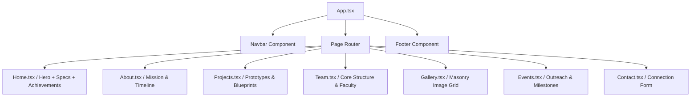

# 🏁 eSJEC Racing - Platform Design Specification

This document provides a comprehensive overview of the design system, visual identity, typography, color palettes, and custom styling patterns used in the official high-performance web platform for **Team eSJEC Racing** at St Joseph Engineering College.

---

## 🏎️ Design Philosophy
The website's visual interface is built to reflect the high-octane energy, engineering precision, and collegiate excellence of an automotive racing team. It employs:
*   **High-Contrast Tech Aesthetics**: Dominated by deep carbons, bright brand reds, and metallic silver accents.
*   **Aerodynamic Geometry**: Angular polygon clips, sharp borders, and sleek horizontal lines that simulate speed and motion.
*   **Micro-Animations & Telemetry Effects**: Hover behaviors that feel reactive and mechanical (resembling engine revs, shifting lights, and exhaust flames).

---

## 🔤 Typography & Font System
The typography is configured via `src/index.css` to support both reading clarity and technical structure.

| Font Family | Style / Purpose | Import Source | Usage Example |
| :--- | :--- | :--- | :--- |
| **Space Grotesk** | Primary Sans-Serif / Clean, futuristic, geometric headings & body. | Google Fonts | Titles, buttons, navigational links, page layouts. |
| **JetBrains Mono** | Secondary Monospace / Developer and telemetry-centric. | Google Fonts | Metric values, technical specs, filter chips. |

---

## 🎨 Color Palette & Theming
The project supports light and dark themes with dynamic transitions managed via a React `ThemeContext`. Custom properties are defined in `src/index.css`:

```css
@theme {
  --font-sans: "Space Grotesk", ui-sans-serif, system-ui, sans-serif;
  --font-mono: "JetBrains Mono", ui-monospace, SFMono-Regular, monospace;

  --color-brand-red: #dc2626;
  --color-brand-silver: #94a3b8;
  --color-brand-chrome: #f8fafc;
}
```

### Theme Variable Mapping

| Variable Name | Light Mode | Dark Mode | Application |
| :--- | :--- | :--- | :--- |
| `--bg-primary` | `#ffffff` | `#050505` | Site-wide background base. |
| `--bg-secondary` | `#f1f5f9` | `#0f1012` | Cards, buttons, panel sections. |
| `--text-primary` | `#0f172a` | `#f8fafc` | Primary text and major headers. |
| `--text-secondary`| `#64748b` | `#94a3b8` | Subtext, labels, and muted text. |
| `--border-primary`| `rgba(0, 0, 0, 0.1)` | `rgba(255, 255, 255, 0.08)` | Borders, divider lines. |
| `--glass-bg` | `rgba(255, 255, 255, 0.8)`| `rgba(15, 16, 18, 0.6)`| Translucent frosted cards. |
| `--carbon-base` | `#f8fafc` | `#0a0a0a` | Carbon fiber pattern grid foundation. |

---

## 🛠️ Backgrounds & Custom Utilities
Custom patterns are loaded directly through CSS utilities to create visual depth:

*   **Carbon Fiber Pattern (`.bg-carbon`)**: A subtle tech grid pattern simulating carbon fiber mesh.
*   **Tire Tread Pattern (`.bg-tread`)**: A diagonal double-hatch pattern mimicking tire tracks on the track.
*   **Slanted Racing Cuts (`.racing-clip`)**: Slanted edges using CSS `clip-path: polygon(0 0, 100% 0, 95% 100%, 0 100%)` for a dynamic velocity look.

---

## ⚡ Micro-Animations & Interactive Classes
The site features several unique micro-animations to enhance user engagement.

### 1. Aerodynamic Card (`.aerodynamic-card`)
Adds a solid brand-red left border that expands on hover while slightly lifting the card and projecting a red-tinted drop shadow:
```css
.aerodynamic-card {
  border-l-4 border-brand-red transition-all duration-300;
  position: relative;
  overflow: hidden;
}
.aerodynamic-card:hover {
  border-l-8 border-brand-red -translate-y-1;
  box-shadow: -10px 10px 30px rgba(220, 38, 38, 0.1);
}
```

### 2. Sheen Effect (`.sheen-effect`)
Creates a reflective white metallic beam passing across the component from left to right on hover.
```css
.sheen-effect::after {
  content: '';
  position: absolute;
  top: -50%; left: -100%; width: 50%; height: 200%;
  background: linear-gradient(to right, rgba(255,255,255,0) 0%, rgba(255,255,255,0.6) 50%, rgba(255,255,255,0) 100%);
  transform: rotate(30deg);
  transition: all 0.5s cubic-bezier(0.4, 0, 0.2, 1);
}
.sheen-effect:hover::after {
  left: 150%;
}
```

### 3. Flame Trail (`.flame-trail`)
Animates a pulsing glow mimicking an exhaust flame behind interactive triggers.
```css
@keyframes flamePulse {
  from { box-shadow: 0 0 10px rgba(220, 38, 38, 0.6), -5px 0 15px rgba(239, 68, 68, 0.4); }
  to { box-shadow: 0 0 20px rgba(185, 28, 28, 0.8), -15px 0 25px rgba(248, 113, 113, 0.5); }
}
```

### 4. Engine Rev (`.engine-rev`)
A mechanical spring-back press animation on click and hover.
```css
.engine-rev:hover {
  transform: scale(1.05) translateY(-2px);
  filter: brightness(1.1);
}
.engine-rev:active {
  transform: scale(0.95);
}
```

### 5. Checkered Finish Line (`.finish-line-hover`)
Transitions the background on hover into a repeating black/transparent checkered racing flag motif.

---

## 🏛️ Application Architecture & Layout Flow



---

## 📂 Design Assets
The main logos and banners are configured to load locally from the public asset directories:
*   **Club Logo**: `/assets/images/esjec_logo.png`
*   **Featured Hero Banner**: `/assets/images/esjec5.jpg` (Team photo with BEETLE 7.0)
*   **Timeline & Event Photography**: Localized under `/assets/images/esjec*.jpg`
