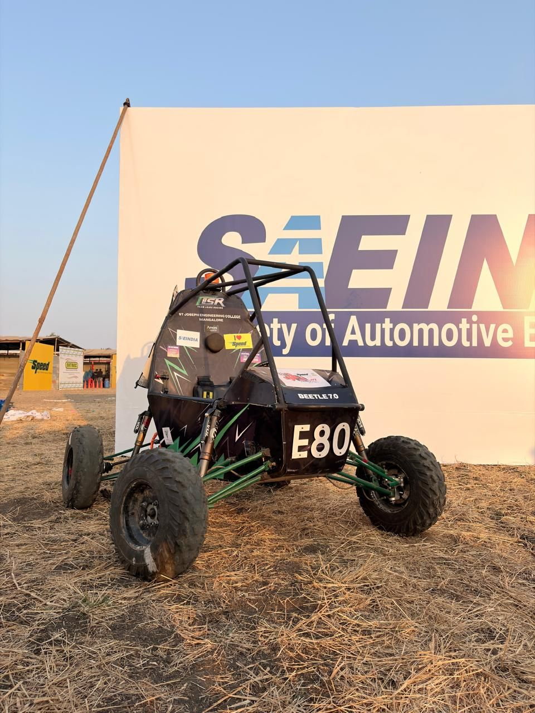

# 🏁 eSJEC Racing - St Joseph Engineering College

Official high-performance web platform for **Team eSJEC Racing**, the automotive and robotics racing division of St Joseph Engineering College, Mangalore.



## 🚀 Overview

Team eSJEC Racing is a multidisciplinary engineering team focused on designing, building, and testing off-road single-seater vehicles. Founded in March 2019, the team bridges the gap between classroom theory and track-ready execution, specializing in All-Terrain Vehicles (ATVs), Electric ATVs, and Go-Karts.

## 🏆 Major Achievements

- **Overall Champions**: ATVC 2023 (Pune)
- **AIR 1**: All Terrain Performance (BAJA 2021)
- **AIR 2**: Overall Dynamic Award (BAJA 2021)
- **AIR 2**: Maneuverability & Brake Performance (BAJA 2021)
- **AIR 8**: Overall Ranking (BAJA 2021)
- **AIR 16**: eBaja Preliminary Round (2020)
- **AIR 7**: CAE Event (SAE BAJA 2023)
- **AIR 11**: Design Event (SAE BAJA 2023)
- **AIR 11**: Preliminary Round (SAE BAJA 2023)

- **AIR 8**: Rock Crawl
- **State Rank 3**: Overall Performance
- **AIR 11**: Endurance Race
- **AIR 20**: Acceleration
- **AIR 31**: SAEINDIA Overall (2020)

## 🏎 Recent Seasons

### BEETLE 7.0 (2026)
The pinnacle of our 2026 journey, focusing on innovation, teamwork, and resilient engineering.

### BEETLE 6.0 (2025)
A contender that fostered unwavering team spirit and provided invaluable technical experience.

### Baja SAEIndia 2021-2022
A journey of persistence, resilience, and countless workshop nights building our 2022 contender.

## 🤝 Community & Outreach

We actively engage with the next generation of engineers through:
- **Technical Workshops**: Showcasing vehicle systems to schools and polytechnics.
- **Skill Development**: Sharing BAJA SAEINDIA methodologies with regional engineering students.
- **Inspiration**: Hosting tech talks for bright young innovators in Udupi and Mangaluru.

## 🛠 Tech Stack

- **Framework**: [React 19](https://react.dev/)
- **Build Tool**: [Vite 6](https://vitejs.dev/)
- **Styling**: [Tailwind CSS 4](https://tailwindcss.com/)
- **Animations**: [Motion](https://motion.dev/)
- **Icons**: [Lucide React](https://lucide.dev/)
- **Type Safety**: [TypeScript](https://www.typescriptlang.org/)

## 🏗 Project Structure

- `src/components`: Reusable UI components (Navbar, Footer, etc.)
- `src/pages`: Main application views (Home, About, Projects, Gallery, etc.)
- `src/data`: Centralized data management for club details and achievements.
- `src/lib`: Utility functions and helper classes.

## 🚦 Getting Started

### Prerequisites

- [Node.js](https://nodejs.org/) (v18 or higher)
- [npm](https://www.npmjs.com/)

### Installation

1. Clone the repository:
   ```bash
   git clone https://github.com/jeswincolaco/esjec-racing.git
   ```

2. Navigate to the project directory:
   ```bash
   cd esjec-racing
   ```

3. Install dependencies:
   ```bash
   npm install
   ```

4. Start the development server:
   ```bash
   npm run dev
   ```

## 🏎 Core Teams

- **Team SJEC Racing (ATV)**: Off-road combustion engineering.
- **eSJEC Racing (Electric ATV)**: Sustainable electric powertrain development.
- **Team ARTEMIS Racing (Go-Kart)**: Precision track racing and tuning.

## 📄 License

This project is part of the **SAEINDIA SJEC Collegiate Club**. All rights reserved.

---

**Built with ❤️ by the eSJEC Racing Development Team.**
